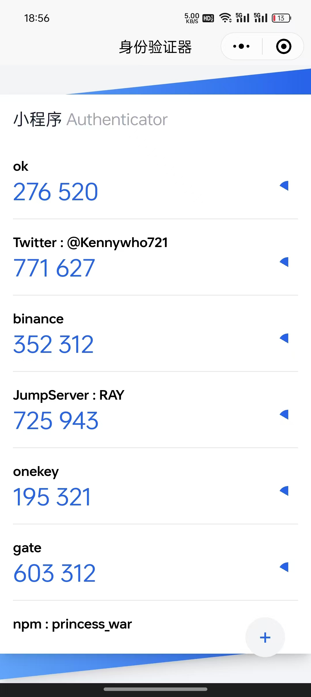

# 基于TOTP的小程序身份验证器

一个功能完善的微信小程序双因素身份验证（2FA）应用，基于 TOTP（Time-based One-Time Password）算法，兼容 Google Authenticator。



## 功能特性

- ✅ **TOTP 动态码生成** - 基于时间的动态验证码生成，每30秒自动更新
- ✅ **多账号管理** - 支持添加、编辑、删除多个账号的验证器
- ✅ **二维码扫描** - 支持扫描 Google Authenticator 格式的二维码快速添加账号
- ✅ **手动输入密钥** - 支持手动输入密钥添加账号
- ✅ **拖拽排序** - 支持拖拽调整账号顺序
- ✅ **导出功能** - 导出为 Google Authenticator 格式的二维码，方便备份和迁移
- ✅ **本地存储** - 所有数据存储在本地，保护隐私安全
- ✅ **实时倒计时** - 可视化倒计时进度条，清晰显示验证码剩余有效时间
- ✅ **导入功能** - 支持从 Google Authenticator 导出的数据导入

## 项目截图

可以扫码体验：


## 技术栈

- **框架**: [uni-app](https://uniapp.dcloud.net.cn/) - 跨平台应用开发框架
- **语言**: TypeScript + Vue 3 (Composition API)
- **样式**: Tailwind CSS + SCSS
- **状态管理**: Pinia
- **TOTP 库**: [@otplib/preset-browser](https://github.com/yeojz/otplib)
- **构建工具**: Vite
- **代码规范**: ESLint

## 开发指南

### 环境要求

- Node.js >= 16
- npm 或 pnpm

### 安装依赖

```bash
npm install
# 或
pnpm install
```

### 开发运行

```bash
# 微信小程序开发
npm run dev:mp-weixin

# 打开微信开发者工具，导入项目
# 项目路径: dist/dev/mp-weixin
```

### 构建生产版本

```bash
# 构建微信小程序
npm run build:mp-weixin
```

### 其他平台

支持多个平台，包括：
- H5 (`dev:h5` / `build:h5`)
- App (`dev:app` / `build:app`)
- 其他小程序平台（支付宝、百度、QQ等）

更多命令请查看 `package.json` 中的 scripts。

### 微信开发者工具

项目已集成 `weapp-ide-cli`，可以使用以下命令：

```bash
# 登录微信开发者工具
npm run weapp:login

# 打开开发版项目
npm run open:dev

# 打开构建版项目
npm run open:build

# 上传开发版
npm run upload:dev

# 上传构建版
npm run upload:build
```

## 使用说明

### 添加账号

1. **扫描二维码添加**
   - 点击右下角的 "+" 按钮
   - 选择"扫描二维码"
   - 扫描服务提供商生成的二维码

2. **手动输入密钥**
   - 点击右下角的 "+" 按钮
   - 选择"输入秘钥"
   - 输入账号名称和密钥

### 管理账号

- **查看验证码**: 主页显示所有账号的动态验证码
- **编辑账号**: 点击账号名称可以修改账号名称
- **删除账号**: 长按账号项，选择删除
- **排序账号**: 在编辑模式下拖拽账号调整顺序

### 导出账号

1. 进入导出页面
2. 选择要导出的账号（最多10个）
3. 生成二维码
4. 使用 Google Authenticator 或其他兼容应用扫描二维码导入

### 数据同步

⚠️ **注意**: 网络同步功能正在开发中，当前版本数据仅存储在本地。

## 项目结构

```
2fa/
├── src/                    # 源代码目录
│   ├── components/         # 组件
│   │   ├── AddModal.vue   # 添加账号模态框
│   │   ├── EditModal.vue  # 编辑账号模态框
│   │   ├── DeleteOTPModal.vue # 删除确认模态框
│   │   └── ...
│   ├── pages/              # 页面
│   │   ├── index/          # 主页
│   │   └── export/         # 导出页面
│   ├── stores/             # Pinia 状态管理
│   ├── utils/              # 工具函数
│   │   ├── 2fa.ts          # TOTP 核心功能
│   │   ├── totp.ts         # OTP URI 解析
│   │   ├── storage.ts      # 本地存储
│   │   └── export.ts       # 导出功能
│   └── ...
├── dist/                   # 构建输出目录
├── package.json
└── README.md
```

## 开发计划

- [x] 导出 Google Authenticator 二维码
- [x] 二维码扫描添加账号
- [x] 手动输入密钥添加账号
- [x] 账号编辑和删除
- [x] 拖拽排序
- [ ] 网络同步功能
- [ ] 工作原理说明文档
- [ ] 明暗色主题切换
- [ ] 单元测试和集成测试

## 工作原理

### TOTP 算法

TOTP (Time-based One-Time Password) 是一种基于时间的一次性密码算法，是 OATH 的开放标准（RFC 6238）。

**基本流程**：
1. 服务器和客户端共享一个密钥（Secret）
2. 双方都使用当前时间戳除以时间窗口（通常是30秒）得到一个时间计数器
3. 使用 HMAC-SHA1 算法，用密钥和时间计数器生成哈希值
4. 从哈希值中提取6位数字作为验证码
5. 每30秒自动更新验证码

### 数据格式

- **密钥存储**: Base32 编码的密钥
- **导入格式**: 支持 Google Authenticator 导出的 protobuf 格式
- **导出格式**: Google Authenticator 兼容的二维码格式

## 安全性说明

- 🔒 所有密钥存储在设备本地，不会上传到服务器
- 🔒 使用标准的 TOTP 算法，与 Google Authenticator 兼容
- 🔒 支持从其他验证器应用导出和导入数据

## 贡献

欢迎提交 Issue 和 Pull Request！

## 许可证

本项目采用 [MIT License](./LICENSE) 许可证。

## 相关链接

- [TOTP 标准 (RFC 6238)](https://tools.ietf.org/html/rfc6238)
- [uni-app 官方文档](https://uniapp.dcloud.net.cn/)
- [Google Authenticator](https://github.com/google/google-authenticator)
